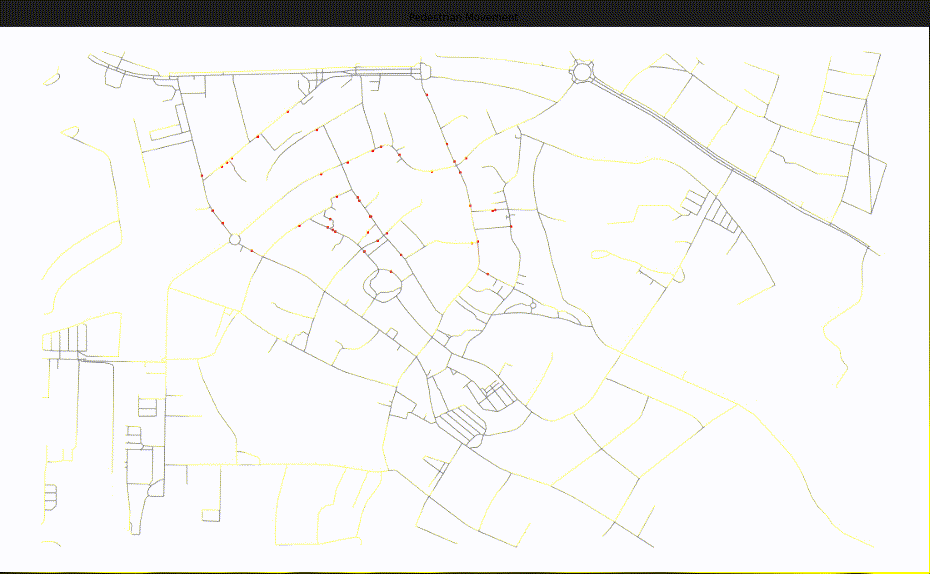

# Agent Based Model Dist Kiss

This repository includes all code and information regarding the ABM. 
There is a Jupyter Notebook including the model and an animation. 

The model includes a street network of the city Quakenbrueck located in Lower Saxony, Germany. Several agents are created at setup. 
Each agents gets an origin and destination point in the city center of Quakenbrueck assigned. The shortest path from the agents origin to its destination is calculated. 
During each timestep the agent walks with a walking speed of 1.5 m/s. The duration of a timestep is 5 seconds (TODO: move walking speed and timestep duration to parameters!)
If they pass by a street node during walking they wait until the current timestep is over.
Agents traverse the street network along the shortest path until they reach their destination. If they have reached it they stay at that location. 

The output of the animation (50 agents, 20 timesteps) currently looks (similar) as shown below: 
(There is some randomness in the agents origins and destinations so the animation will look different in each model run.) 
